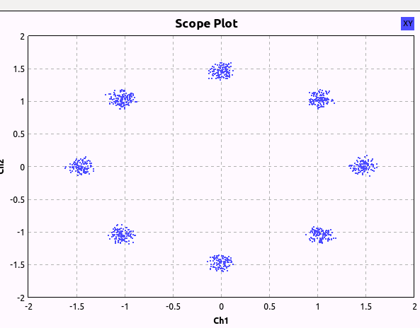
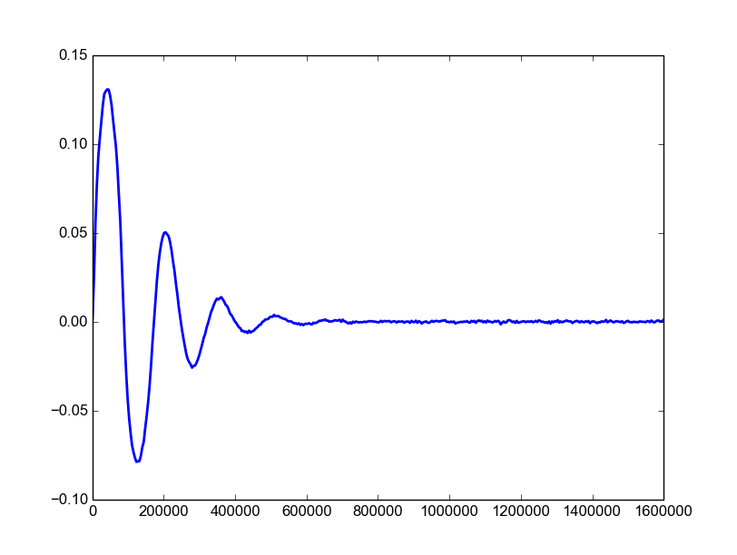
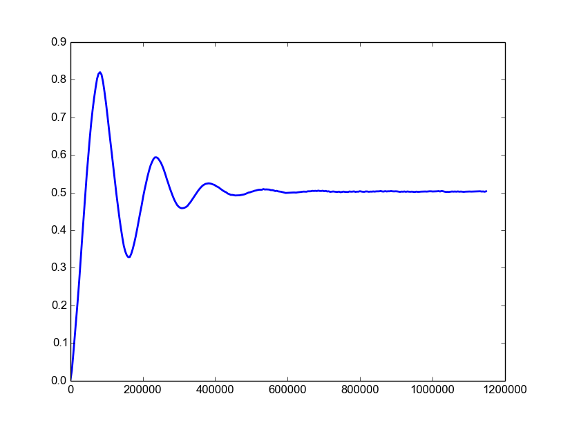
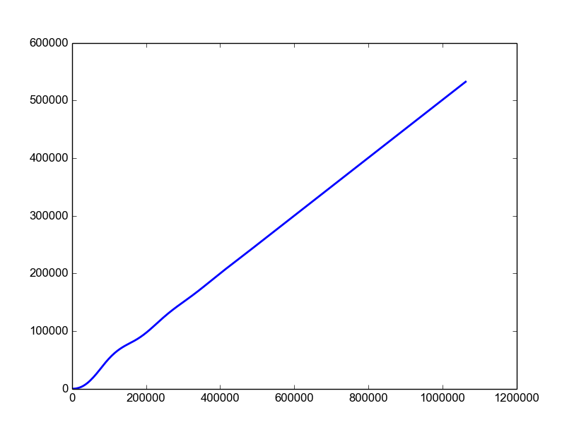

# 8 PSK Costas Loop

This is a python implementation of an 8-PSK Costas Loop made as on [OOT Module](https://gnuradio.org/redmine/projects/gnuradio/wiki/OutOfTreeModules) for [GNURadio](https://github.com/gnuradio/gnuradio). It can work as a standalone python script as well.

The project builds two GNURadio blocks, an 8-PSK threshold block to carry out phase detection along with a complete working Costas Loop (which uses the threshold code).

## Installation Instructions

* Make sure you have `cmake`, `numpy` and `gnuradio` installed.
* Clone the repository, `git clone https://github.com/martiansideofthemoon/8-PSK-Costas-Loop`.
* `cd 8-PSK-Costas-Loop/build`
* Once inside the build folder, run `cmake ../`. This should generate a Makefile in your `build` directory.
* In the same folder, run `make`.
* In the same folder, run `sudo make install`
* Run `gnuradio-companion`. If the block doesn't show up / doesn't work (this is likely), move to the next section.

## Troubleshooting

* **Block doesn't show up in GRC** - By default, `sudo make install` might have placed `costas8_sp_threshold.xml` and `costas8_costas_loop.xml` in the wrong folder. You can correct it in this way -
  * `sudo cp /usr/local/share/gnuradio/grc/blocks/costas8_costas_loop.xml /usr/share/gnuradio/grc/blocks/`
  * `sudo cp /usr/local/share/gnuradio/grc/blocks/costas8_sp_threshold.xml /usr/share/gnuradio/grc/blocks/`

* **Block gives a swig import error** - Since GNURadio assumes a C++ implementation, a slight modification is needed in the `__init__.py` file.
  * Open the `__init__.py` file with `root` access. (file is located at  `/usr/local/lib/python2.7/dist-packages/costas8/__init__.py`)
  * Comment the line `from costas8_swig import *` (line 45). Save the file and restart GRC.

Since this is going astray from the official OOT Module blocks, feel free to mail me or leave an issue if you encounter any installation issue.

## Testing

You can test the installation by running the two GRC files (one for each block) in the root directory of the folder. You should get a stable 8 PSK output in the XY Plot that looks like this -

## Code and Plots

The signal processing blocks can be found in `python/costas_loop.py` and `python/sp_threshold.py`. A few plots of error, IIR filter output and feedback are shown below,

